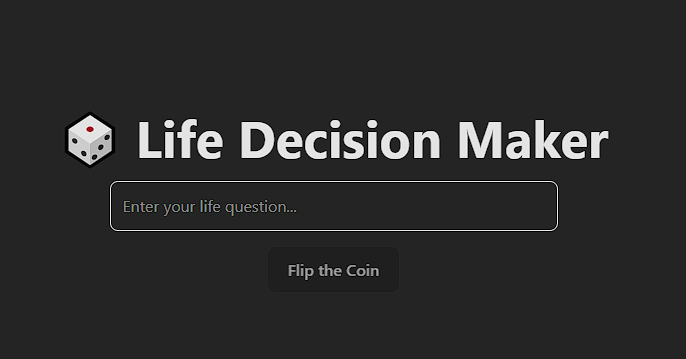

<p align="center">
    
</p>
<p align="center"><h1 align="center">LIFE-DECISION-MAKER</h1></p>
<p align="center">
	<em><code>❯ Gamble away your life with AI</code></em>
</p>
<p align="center">
	
	
	
</p>
<p align="center"><!-- default option, no dependency badges. -->
</p>
<p align="center">
	<!-- default option, no dependency badges. -->
</p>
<br>

##  Table of Contents

- [ Overview](#-overview)
- [ Features](#-features)
- [ Project Structure](#-project-structure)
  - [ Project Index](#-project-index)
- [ Getting Started](#-getting-started)
  - [ Prerequisites](#-prerequisites)
  - [ Installation](#-installation)
  - [ Usage](#-usage)
  - [ Testing](#-testing)
- [ Project Roadmap](#-project-roadmap)
- [ Contributing](#-contributing)
- [ License](#-license)
- [ Acknowledgments](#-acknowledgments)

---

##  Overview

<code>🎲 A simple and fun web app to help users make life decisions.  
Write your question, flip a virtual coin with animation, and get an AI-generated thoughtful response based on the coin result — no login required.</code>

---

##  Features

<code>- Clean, minimal Vue 3 + Vite frontend with Tailwind CSS styling  
- Smooth coin flip animation using animejs  
- AI-powered responses using [Puter.js](https://js.puter.com/) or Cloudflare Workers with OpenAI (configurable)  
- No user login, fully anonymous  
- Lightweight and fast with a focus on performance  
- Input validation and basic security checks</code>

---

##  Project Structure

```sh
└── ai-decision-maker/
    ├── README.md
    ├── index.html
    ├── package-lock.json
    ├── package.json
    ├── public
    │   ├── favicon.ico
    │   ├── manifest.json
    │   └── vite.svg
    ├── src
    │   ├── App.vue
    │   ├── assets
    │   ├── components
    │   ├── main.js
    │   └── style.css
    └── vite.config.js
```


###  Project Index
<details open>
	<summary><b><code>AI-DECISION-MAKER/</code></b></summary>
	<details> <!-- __root__ Submodule -->
		<summary><b>__root__</b></summary>
		<blockquote>
			<table>
			<tr>
				<td><b><a href='https://github.com/SxvitoCodes/ai-decision-maker/blob/master/package-lock.json'>package-lock.json</a></b></td>
			</tr>
			<tr>
				<td><b><a href='https://github.com/SxvitoCodes/ai-decision-maker/blob/master/vite.config.js'>vite.config.js</a></b></td>
			</tr>
			<tr>
				<td><b><a href='https://github.com/SxvitoCodes/ai-decision-maker/blob/master/package.json'>package.json</a></b></td>
			</tr>
			<tr>
				<td><b><a href='https://github.com/SxvitoCodes/ai-decision-maker/blob/master/index.html'>index.html</a></b></td>
			</tr>
			</table>
		</blockquote>
	</details>
	<details> <!-- src Submodule -->
		<summary><b>src</b></summary>
		<blockquote>
			<table>
			<tr>
				<td><b><a href='https://github.com/SxvitoCodes/ai-decision-maker/blob/master/src/style.css'>style.css</a></b></td>
			</tr>
			<tr>
				<td><b><a href='https://github.com/SxvitoCodes/ai-decision-maker/blob/master/src/main.js'>main.js</a></b></td>
			</tr>
			<tr>
				<td><b><a href='https://github.com/SxvitoCodes/ai-decision-maker/blob/master/src/App.vue'>App.vue</a></b></td>
			</tr>
			</table>
			<details>
				<summary><b>components</b></summary>
				<blockquote>
					<table>
					<tr>
						<td><b><a href='https://github.com/SxvitoCodes/ai-decision-maker/blob/master/src/components/Coin.vue'>Coin.vue</a></b></td>
					</tr>
					<tr>
						<td><b><a href='https://github.com/SxvitoCodes/ai-decision-maker/blob/master/src/components/Result.vue'>Result.vue</a></b></td>
					</tr>
					<tr>
						<td><b><a href='https://github.com/SxvitoCodes/ai-decision-maker/blob/master/src/components/InputForm.vue'>InputForm.vue</a></b></td>
					</tr>
					</table>
				</blockquote>
			</details>
		</blockquote>
	</details>
	<details> <!-- public Submodule -->
		<summary><b>public</b></summary>
		<blockquote>
			<table>
			<tr>
				<td><b><a href='https://github.com/SxvitoCodes/ai-decision-maker/blob/master/public/manifest.json'>manifest.json</a></b></td>
			</tr>
			</table>
		</blockquote>
	</details>
</details>

---
##  Getting Started

###  Prerequisites

Before getting started with ai-decision-maker, ensure your runtime environment meets the following requirements:

- **Programming Language:** Vue.js
- **Package Manager:** Npm


###  Installation

Install ai-decision-maker using one of the following methods:

**Build from source:**

1. Clone the ai-decision-maker repository:
```sh
git clone https://github.com/SxvitoCodes/ai-decision-maker
```

2. Navigate to the project directory:
```sh
cd ai-decision-maker
```

3. Install the project dependencies:


**Using `npm`** &nbsp;

```sh
npm install
```


###  Usage
Run ai-decision-maker using the following command:
**Using `npm`** &nbsp; []()

```sh
npm run dev
```

---
##  Contributing

- **💬 [Join the Discussions](https://github.com/SxvitoCodes/ai-decision-maker/discussions)**: Share your insights, provide feedback, or ask questions.
- **🐛 [Report Issues](https://github.com/SxvitoCodes/ai-decision-maker/issues)**: Submit bugs found or log feature requests for the `ai-decision-maker` project.
- **💡 [Submit Pull Requests](https://github.com/SxvitoCodes/ai-decision-maker/blob/main/CONTRIBUTING.md)**: Review open PRs, and submit your own PRs.

<details closed>
<summary>Contributing Guidelines</summary>

1. **Fork the Repository**: Start by forking the project repository to your github account.
2. **Clone Locally**: Clone the forked repository to your local machine using a git client.
   ```sh
   git clone https://github.com/SxvitoCodes/ai-decision-maker
   ```
3. **Create a New Branch**: Always work on a new branch, giving it a descriptive name.
   ```sh
   git checkout -b new-feature-x
   ```
4. **Make Your Changes**: Develop and test your changes locally.
5. **Commit Your Changes**: Commit with a clear message describing your updates.
   ```sh
   git commit -m 'Implemented new feature x.'
   ```
6. **Push to github**: Push the changes to your forked repository.
   ```sh
   git push origin new-feature-x
   ```
7. **Submit a Pull Request**: Create a PR against the original project repository. Clearly describe the changes and their motivations.
8. **Review**: Once your PR is reviewed and approved, it will be merged into the main branch. Congratulations on your contribution!
</details>

<details closed>
<summary>Contributor Graph</summary>
<br>
<p align="left">
   <a href="https://github.com/SxvitoCodes/ai-decision-maker/graphs/contributors">
      
   </a>
</p>
</details>

---

##  License

This project is protected under the MIT License.

---

##  Acknowledgments

- List any resources, contributors, inspiration, etc. here.

---